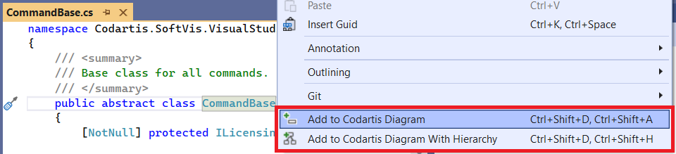
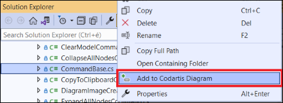
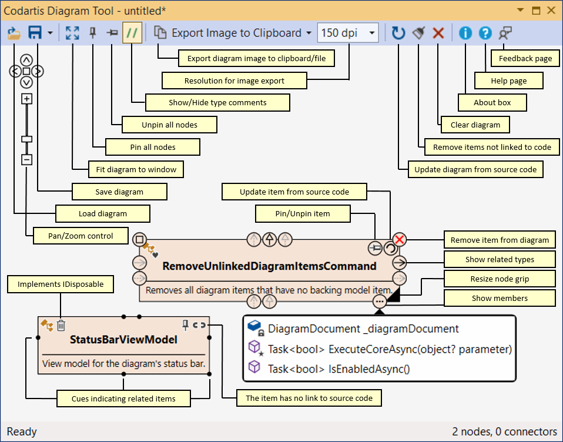
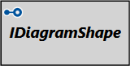
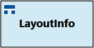
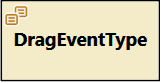
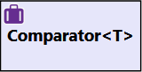
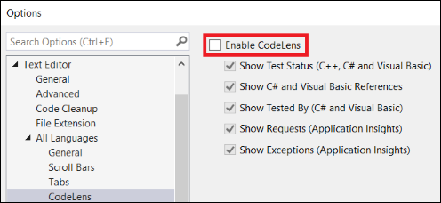

# Codartis Diagram Tool Help

* [Getting started](#getting-started)
  * [Installing](#installing)
  * [Activating or starting a trial period](#activating-or-starting-a-trial-period)
  * [Adding items to diagram from source code](#adding-items-to-diagram-from-source-code)
  * [Adding items to diagram from Solution Explorer](#adding-items-to-diagram-from-solution-explorer)
* [Details](#details)
  * [Controls](#controls)
  * [Pan and zoom](#pan-and-zoom)
  * [Jumping from diagram to source code](#jumping-from-diagram-to-source-code)
  * [Diagram legend](#diagram-legend)
  * [Updating the diagram from source code](#updating-the-diagram-from-source-code)
  * [Performance limitations](#performance-limitations)
* [Troubleshooting](#troubleshooting)

# Getting started

## Installing
* Download from Visual Studio Marketplace
  * [VS 2019 version](https://marketplace.visualstudio.com/items?itemName=FerencVizkeleti.QuickDiagramToolforC)
  * [VS 2022 version](https://marketplace.visualstudio.com/items?itemName=FerencVizkeleti.diagramtool-vs2022)
* Or inside Visual Studio > Extensions > Manage Extensions > type "Codartis" in the search box > click Download

## Activating or starting a trial period
> A solution must be open otherwise the tool window is not available.
* Open the tool window 
  * Visual Studio main menu > View > Other Windows > Codartis Diagram Tool
  * Or use the keyboard shortcut: **CTRL+SHIFT+D, CTRL+SHIFT+D** (yes, push the key combination twice)
* In the About Codartis Diagram Tool panel:
  * Use the **Activate** button if you already have a License Key.
  * Use the **Start trial** button to start a 30-day trial period.

## Adding items to diagram from source code
* In the source code editor window right-click on a type or member symbol > Add to Codartis Diagram
* Or position the caret on the name of a type or member and use the keyboard shortcuts:
  * Adding an item: **CTRL+SHIFT+D, CTRL+SHIFT+A** 
  * Adding an entire type hierarchy: **CTRL+SHIFT+D, CTRL+SHIFT+H** 

## Adding items to diagram from Solution Explorer
* In the Solution Explorer window right-click on a file or folder > Add to Codartis Diagram

# Details

## Controls

## Pan and zoom
* Use the mouse: 
  * Pan by holding down the left mouse button.
  * Zoom with the mouse wheel.
* Or use the keyboard (only if the diagram window has the focus): 
  * Pan with the cursor keys.
  * Zoom with W and S keys (FPS shooter-style :)
* Or use the pan and zoom control on the diagram.

## Jumping from diagram to source code
* Double-click on a diagram shape.
* It works only for those types that were found in the source code (and not in metadata).

## Diagram legend

| class | interface | struct | enum | delegate |
|-------|-----------|--------|------|----------|
|  |  |  |  |  |

* Type name formatting meaning:
  * *Italic* means abstract type.
  * **Bold** means that it was found in source code.
  * Normal (non-bold) means that it was found in metadata (referenced assembly).

## Updating the diagram from source code
If the source code changes you can update the diagram from the current source code.

* Updates those entities that have the same fully qualified name.
* Removes those entities that no longer exist in code.
* Unfortunately this feature can't track type renames so renamed types will be removed from the diagram and must be manually added back if needed.

## Performance limitations
This tool queries the same model that Visual Studio builds for IDE features like IntelliSense, CodeLens, etc. 

For large solutions it may take a while until these models are built and updated.

The status bar of the diagram tool window indicates when it waits for the underlying parser.

# Troubleshooting

## Diagram update progress gets stuck for a long time with low CPU usage
Other symptoms
* Task Manager > Details shows that a process called ServiceHub.RoslynCodeAnalysisService.exe consumes low CPU but a large (and continously increasing) thread count. 

Cause
* This may indicate that Codartis Diagram Tool and Visual Studio's CodeLens feature interfere with each other.

Solution
* Turn off CodeLens: 
  * Visual Studio main menu > Tools > Options > Text Editor > All Languages > CodeLens > Clear the "Enable CodeLens" checkbox

* Restart Visual Studio.

## Double-clicking the VSIX file: "The requested operation requires elevation"
Details
* When trying to install the tool by downloading the VSIX file and double-clicking it shows the above error message.

Solution
* Right-click the VSIX file > Open with... > Choose "Microsoft Visual Studio Version Selector" from the list (might need to click "More apps" to find the item in the list).
* When prompted: "Do you want to allow this app to make changes to your device?" > Click "Yes"
