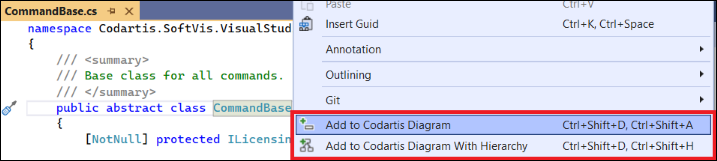

# Codartis Diagram Tool Help

* [Getting started](#getting-started)
  * [Installing](#installing)
  * [Activating or starting a trial period](#activating-or-starting-a-trial-period)
  * [Adding items to diagram from source code](#adding-items-to-diagram-from-source-code)
  * [Adding items to diagram from Solution Explorer](#adding-items-to-diagram-from-solution-explorer)
* [Details](#setails)
* [Troubleshooting](#troubleshooting)

# Getting started

## Installing
* Download from Visual Studio Marketplace
  * [VS 2019 version](https://marketplace.visualstudio.com/items?itemName=FerencVizkeleti.QuickDiagramToolforC)
  * [VS 2022 version]()
* Or inside Visual Studio > Extensions > Manage Extensions > type "Codartis" in the search box > click Download

## Activating or starting a trial period
* Open the tool window 
  * Visual Studio main menu > View > Other Windows > Codartis Diagram Tool
  * Or use the keyboard shortcut: **CTRL+SHIFT+D, CTRL+SHIFT+D** (yes, push the key combination twice)
* In the About Codartis Diagram Tool panel:
  * Use the **Activate** button if you already have a License Key.
  * Use the **Start trial** button to start a 30-day trial period.

## Adding items to diagram from source code
* In the source code editor window right-click on a type or member symbol > Add to Codartis Diagram
* Or position the caret on the name of a type or member and use the keyboard shortcuts:
  * Adding an item: **CTRL+SHIFT+D, CTRL+SHIFT+A** 
  * Adding an entire type hierarchy: **CTRL+SHIFT+D, CTRL+SHIFT+H** 

## Adding items to diagram from Solution Explorer
* In the Solution Explorer window right-click on a file or folder > Add to Codartis Diagram

# Details

### Show/Hide descriptions
* Use the "Show/Hide Descriptions" toolbar button to show/hide type descriptions (the summary part of the type's XML documentation).

### Extend the diagram with related entities
* Click on the pop-up mini-buttons on the diagram nodes to show related entities.

### Type features on the diagram
* Black dots on the side of the type's rectangle means that it has some related entities.
* *Italic* type name means abstract type.
* **Bold** type name means that it was found in source code.
* Normal (non-bold) type name means that it was found in metadata (referenced assembly).

### Navigate from the diagram to the corresponding source file
* Double-click on a diagram shape.
* It works only for those types that were found in the source code (and not in metadata).

### Remove items from the diagram
* Click on the "remove" mini-button on a shape to remove it from the diagram.

### Export diagram to file or copy to clipboard
* Use the "Copy to Clipboard" / "Save to File..." toolbar buttons to save/copy the diagram.
* Set the desired resolution in DPI (dots per inch).

### Clear the diagram
* Use the "Clear Diagram" toolbar button to remove all shapes from the diagram.

### Update the diagram to reflect code changes
* Use the "Update Diagram from Code" toolbar button to synchronize the diagram with the changed code.

* Updates those entities that have the same fully qualified name.
* Removes those entities that no longer exist in code.
* Unfortunately this feature can't track type renames so renamed types will be removed from the diagram and must be manually added back if needed.

### Pan and zoom on the diagram
* Use the mouse: 
  * Pan by holding down the left mouse button.
  * Zoom with the mouse wheel.
* Or use the keyboard (only if the diagram window has the focus): 
  * Pan with the cursor keys.
  * Zoom with W and S keys (FPS shooter-style :)
* Or use the pan and zoom control on the diagram.

### Zoom to the diagram
* Use the "Fit Diagram to Window" toolbar button, or the rectangle in the Pan and Zoom Control.

# Troubleshooting
 