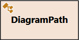

# Codartis Diagram Tool Help

Codartis Diagram Tool is a Visual Studio extension that creates interactive diagrams from C# types and members. The diagram can be used to explore code structure and relationships, navigate between code files and export diagram images to be used in documentation.

- [Getting started](#getting-started)
  - [Installing](#installing)
  - [Supported Visual Studio versions](#supported-visual-studio-versions)
  - [Activating the product or starting a trial period](#activating-the-product-or-starting-a-trial-period)
  - [Adding items to diagram from source code](#adding-items-to-diagram-from-source-code)
  - [Adding items to diagram from Solution Explorer](#adding-items-to-diagram-from-solution-explorer)
- [Details](#details)
  - [Controls at a glance](#controls-at-a-glance)
  - [Pan and zoom](#pan-and-zoom)
  - [Selecting Nodes](#selecting-nodes)
  - [Context Menu](#context-menu)
  - [Automatic layout and manual adjustments](#automatic-layout-and-manual-adjustments)
  - [Jumping from diagram to source code](#jumping-from-diagram-to-source-code)
  - [Diagram notation](#diagram-notation)
  - [Updating the diagram from source code](#updating-the-diagram-from-source-code)
  - [Monitoring and canceling background tasks](#monitoring-and-canceling-background-tasks)
- [Troubleshooting](#troubleshooting)
  - [Codartis Diagram Tool is installed but unavailable](#codartis-diagram-tool-is-installed-but-unavailable)
  - [Double-clicking the VSIX file: "The requested operation requires elevation"](#double-clicking-the-vsix-file-the-requested-operation-requires-elevation)
  - [Diagram update progress gets stuck for a long time without progress](#diagram-update-progress-gets-stuck-for-a-long-time-without-progress)

## Getting started

### Installing
* Download Codartis Diagram Tool as a Visual Studio Extension package (VSIX file) and install it:
  * Download from Visual Studio Marketplace: 
    * [VS 2019 version](https://marketplace.visualstudio.com/items?itemName=FerencVizkeleti.QuickDiagramToolforC)
    * [VS 2022 version](https://marketplace.visualstudio.com/items?itemName=FerencVizkeleti.diagramtool-vs2022)
  * Double-click the downloaded VSIX file and follow the installer's instructions.
  * If getting a permission error then check out the [Troubleshooting](#troubleshooting) section or install from Visual Studio (see below).

Or

* Install Codartis Diagram Tool from within Visual Studio:
  * Go to Main menu > Extensions > Manage Extensions
  * Choose Online and type "Codartis" in the search box 
  * Click Download
  * Codartis Diagram Tool will be installed when you restart Visual Studio.

> You can find older releases [here](https://codartis.com/diagram-tool/releases.html).

### Supported Visual Studio versions
* **Visual Studio 2019**
  * Minimum required version: **16.11+**
* **Visual Studio 2022** 
  * Minimum required version: **17.2+**

> All Visual Studio editions are supported: Community/Professional/Enterprise

### Activating the product or starting a trial period
Make sure that a solution is open otherwise Codartis Diagram Tool may not be available despite being installed. Check the [Troubleshooting](#troubleshooting) section for more details.
 
* Open the Codartis Diagram Tool window 
  * Visual Studio main menu > View > Other Windows > Codartis Diagram Tool
  * Or use the keyboard shortcut: **CTRL+SHIFT+D, CTRL+SHIFT+D** (yes, push the key combination twice)

* In the About Codartis Diagram Tool panel:
  * If you already have a license key, then click the **Activate** button.
  * If you don't have a license key then start a 30-day trial period by clicking the **Start trial** button.

> To purchase a license key visit: [codartis.com](https://codartis.com/index.html#pricing)

### Adding items to diagram from source code
* In the source code editor window right-click on a type or member symbol
  * In the context menu click **Add to Codartis Diagram** or **Add to Codartis Diagram With Hierarchy**

* Or position the caret on the name of a type or member and use the keyboard shortcuts:
  * Adding an item: **CTRL+SHIFT+D, CTRL+SHIFT+A** 
  * Adding an entire type hierarchy: **CTRL+SHIFT+D, CTRL+SHIFT+H** 

### Adding items to diagram from Solution Explorer
* In the Solution Explorer window right-click on a file or folder
  * In the context menu click **Add to Codartis Diagram**

> Tip: Don't add too many items (eg. whole projects) to a diagram because it will be cluttered and sluggish. About 50 items is a practical limit for both layout speed and comprehension.

## Details

### Controls at a glance

### Pan and zoom
* Use the mouse: 
  * Pan by holding down the left mouse button.
  * Zoom with the mouse wheel.
* Or use the keyboard (only if the diagram window has the focus): 
  * Pan with the cursor keys.
  * Zoom with W and S keys (FPS shooter-style :)
* Or use the pan and zoom control on the diagram.

### Selecting Nodes
* Click a node to select/unselect
* CTRL+Click or SHIFT+Click: add/remove node to/from selection
* CTRL+Drag: select multiple nodes
* SHIFT+Drag: add nodes to selection

### Context Menu
Use the context menu to access the following commands:
* Select All Nodes (shortcut: CTRL+A)
* Invert Selection
* Pin Nodes (Selected/All)
* Unpin Nodes (Selected/All)
* Remove Nodes (Selected/All But Selected/This Node/All But This Node)

### Automatic layout and manual adjustments
Codartis Diagram Tool tries to automatically create a layout that is both clear and meaningful. As the diagram changes the layout is continuously adapted.

However, you can manually adjust the layout by moving (dragging) nodes and by pinning/unpinning nodes.
* To move a node drag it using the left mouse button.
* Moved nodes become pinned automatically (so they don't try to move back to wherever they want).
* To pin/unpin a node click its "pin" button, or use the Context Menu.

The automatic layout follows these rules:
* Nodes must not overlap.
* Inheritance and implementation hierarchies are arranged "top-down", that is, the more abstract types are above the more concrete ones. 
* Siblings in inheritance hierarchies are ordered by name from left to right.
* Pinned nodes are moved only if there's a conflict with the above rules.

### Jumping from diagram to source code
* Double-click on a diagram node.
* It works only for those types that were found in the source code (and not in metadata).

### Diagram notation
Codartis Diagram Tool uses a subset of the standard UML class diagram notation with additional visual hints that are familiar for Visual Studio users (eg. icons for class, struct, etc.)

| Class | Interface | Struct | Enum | Delegate |
|-------|-----------|--------|------|----------|
|  |  |  |  |  |

Additional details:
* Meaning of the different type name formattings:
  * *Italic* means abstract type.
  * **Bold** means that it was found in source code.
  * Normal (non-bold) means that it was found in metadata (referenced assembly).

| Association | Inheritance | Interface implementation  | Other dependencies |
|------------|--------------------------|-------------|--------------------|
|  |  |   |  | 

Additional details:
* The arrow heads always point in the direction of the dependency.
  * That is, A -> B means A depends on B.
* Fields and properties imply associations from the type that contains the field/property to the type of the field/property.
* Assocations can have a label at the "to" side of the relationship that can contain names and multiplicity markers.
  * The name of the label is the name of the field/property that represents the association in the source code, if it differs from the type of the field/property.
  * If there are multiple assocations to the same type then they are listed as multiple labels. In case of more then 2 labels a "..." symbol is displayed and the whole list can be displayed as a tooltip when pointing at the "..." sign.

* Assocation multiplicities are indicated as one of the following markers.
    * '0..1' means an optional association (a nullable type in source code).
    * '\*' means "many" (a collection in source code).
    * '[key]' means a dictionary with the given key type.
    * No multiplicity marker means a multiplicity of '1'.
* In the case of "other dependencies", the type of the dependency is indicated with a UML stereotype.
  * E.g.&lt;&lt;typeDefinition&gt;&gt;
* For relationships between a constructed generic type and it type definition, the type arguments are indicated as labels at the "to" side of the dependency arrow.

### Updating the diagram from source code
If the source code changes you can update the diagram from the current source code.
* You can update a single node (and its relationships) by clicking the node's update button.
* Or you can update the whole diagram by using the Update button on the Codartis Diagram Tool window toolbar.

> When working with large solutions prefer updating only single nodes, because updating a whole diagram might take a long time. Even if there are not many items on the diagram, all of their relationships must be searched in the whole solution, that's why the speed of this operation is determined mainly by the solution size.

Diagram node update is based on their fully qualified name (type name + namespace name).
* If a diagram node is found in source code then its relationships and members are updated.
* If a diagram node is not found in source code then it is removed from the diagram.

> Unfortunately this feature can't track type renames so renamed types will be removed from the diagram and must be manually added back if needed.

### Monitoring and canceling background tasks
Codartis Diagram Tool builds its code model by querying Visual Studio's C# parser. These queries can take a while, especially right after opening a solution when Visual Studio is still busy parsing the entire source code.

To keep the diagram tool responsive these queries are performed as background tasks. The diagram tool's status bar displays the number and progress of currently running background tasks.

You can cancel the background tasks by right-clicking on the spinning circle icon on the left side of the status bar and clicking Cancel All Tasks.

## Troubleshooting

### Codartis Diagram Tool is installed but unavailable
Symptoms
* Codartis Diagram Tool's menu items don't show up in Visual Studio  Main menu > View > Other Windows and in context menus.
* When you try to activate Codartis Diagram Tool with the keyboard shortcut, Visual Studio displays the following message in the status bar: 
  > The key combination (Ctrl+Shift+D, Ctrl+Shift+D) is bound to command (Codartis Diagram Tool) which is not currently available.

Cause
* Codartis Diagram Tool uses the C# parser's model that is created by Visual Studio for the current solution. If there's no open solution then Codartis Diagram Tool doesn't get loaded by Visual Studio.

Solution
* Open a solution in Visual Studio.
* If Codartis Diagram Tool is still unavailable then wait a few moments until Visual Studio finishes loading it.

### Double-clicking the VSIX file: "The requested operation requires elevation"
Details
* When trying to install the tool by downloading the VSIX file and double-clicking it, the above error message is displayed.

Solution
* Right-click the VSIX file > Open with... > Choose "Microsoft Visual Studio Version Selector" from the list (might need to click "More apps" to find the item in the list).
* When prompted: "Do you want to allow this app to make changes to your device?" > Click "Yes"

### Diagram update progress gets stuck for a long time without progress
Symptoms
* Task Manager > Details shows that a process called ServiceHub.RoslynCodeAnalysisService.exe consumes low CPU but a large (and continously increasing) thread count.

Cause
* This may indicate that Codartis Diagram Tool and Visual Studio's CodeLens feature interfere with each other.

Solution
* Turn off CodeLens: 
  * Visual Studio main menu > Tools > Options > Text Editor > All Languages > CodeLens > Clear the "Enable CodeLens" checkbox
  

* Restart Visual Studio.