# Codartis Diagram Tool - Diagram Elements and Notation

Learn which source code items can be represented on a diagram and how their relationships are visualized.

---

**Help Topics**
* [Getting Started](getting-started.md)
* [Using the Diagram Tool](how-to-use.md)
* Diagram Elements and Notation
* [Troubleshooting](troubleshooting.md)

---

**Page Overview**
- [Visualizing the Actual Source Code](#visualizing-the-actual-source-code)
- [UML Notation](#uml-notation)
- [Diagram Nodes](#diagram-nodes)
  - [Diagram Node Notations](#diagram-node-notations)
- [Diagram Connectors](#diagram-connectors)
  - [Connector Notations](#connector-notations)

---

## Visualizing the Actual Source Code
Codartis Diagram Tool generates diagrams based on the compiler’s model, ensuring that every diagram node corresponds to an actual source code entity (such as namespaces, classes, and methods).

Diagram connectors (arrows) represent relationships within the static structure of the code — for example, associations, inheritance, and assembly references.

Because the tool relies on the compiler’s model, the diagrams always reflect the true state of the source code.

## UML Notation
Codartis Diagram Tool uses a subset of the standard [UML class diagram](https://en.wikipedia.org/wiki/Class_diagram) notation, extended with namespaces, assemblies, and familiar Visual Studio visual cues (such as icons for classes, structs, and other symbols).

Future versions aim to include additional relationships — both low-level (method calls, property access, object creation) and high-level (namespace dependencies).

> If you’d like to see these features implemented, you can vote or comment on the following discussions:
> * [Enhance visual exploration of low-level structures in code](https://github.com/Codartis/DiagramTool/discussions/8)
> * [Enhance visual exploration of high-level code structures](https://github.com/Codartis/DiagramTool/discussions/7)
 
## Diagram Nodes

The following source code entities are represented on the diagram.

* Assemblies (both project output and referenced assemblies)
* Namespaces
* All C# types: class, struct, interface, enum, delegate (including generic type definitions and constructed generic types)
* Type members: constants, fields, properties, methods, and events

> Note: C# records are actually classes (or structs for record structs), so they are modeled accordingly.

### Diagram Node Notations

| Class | Interface | Struct | Enum | Delegate | Namespace | Assembly |
|-------|-----------|--------|------|----------|-----------|----------|
| 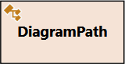 | 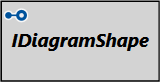 | 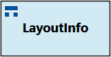 | 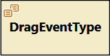 | 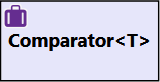 | 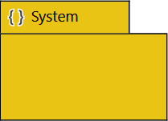 | 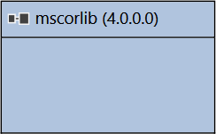

Meaning of type and member name formatting:
* *Italic* — abstract type
* **Bold** — found in source code
* Normal (non-bold) — found in metadata (referenced assembly)
* <u>Underlined</u> — static type or member

Access modifiers (public, private, etc.) are shown using standard Visual Studio icons.

Types implementing IDisposable are marked with a trash can icon.

## Diagram Connectors

The following relationships between source code entities are represented as connectors on the diagram:

* Association
  * Fields and properties imply associations from the type that defines them to the type they reference
* Inheritance
* Interface implementation
* Generic type construction
* Usage as generic type argument
* Containment
* Assembly reference

### Connector Notations

| Association | Inheritance | Interface implementation  | Other dependencies |
|------------|--------------------------|-------------|--------------------|
| 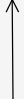 | 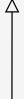 | 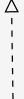  | 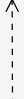 | 

> Arrowheads always point in the direction of the dependency: A -> B means A depends on B.

Associations can display a label at the “to” end of the connector that shows the field or property name representing the relationship in the source code.
* If the name differs from the associated type, it is shown in the label.
* Multiple associations to the same type are shown with multiple labels.

Association multiplicities are indicated using the following markers:
* 0..1 — optional (nullable type)
* \* — many (a collection)
* [key] — dictionary with the specified key type
* no marker — exactly one

For “other dependencies,” the type of dependency is indicated using a UML stereotype, e.g., &lt;&lt;typeDefinition&gt;&gt;.

> For relationships between a constructed generic type and its type definition, type arguments are shown as labels at the “to” side of the connector.
> 
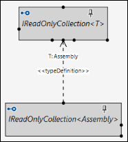

