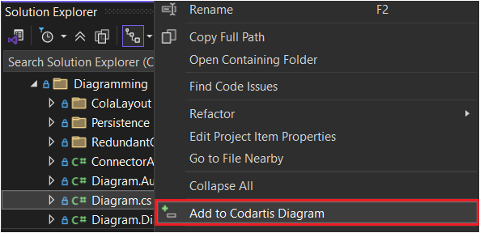

# Codartis Diagram Tool - Getting Started

Learn how to install the tool, start a trial, activate your license, and add source code symbols to your diagrams.

---

**Help Topics**
* Getting Started
* [Using the Diagram Tool](how-to-use.md)
* [Diagram Elements and Notation](diagram-notation.md)
* [Troubleshooting](troubleshooting.md)

---

**Page Overview**
- [Supported Visual Studio Versions](#supported-visual-studio-versions)
- [Installation](#installation)
  - [Option 1: Using the Extension Manager in Visual Studio](#option-1-using-the-extension-manager-in-visual-studio)
  - [Option 2: Using the VSIX Installer](#option-2-using-the-vsix-installer)
- [Activating a License Key or Starting a Trial](#activating-a-license-key-or-starting-a-trial)
- [Limited Mode](#limited-mode)
- [Adding Diagram Items from a Source Code Editor Window](#adding-diagram-items-from-a-source-code-editor-window)
  - [Using the Context Menu](#using-the-context-menu)
  - [Using a Keyboard Shortcut](#using-a-keyboard-shortcut)
- [Adding Diagram Items from Solution Explorer](#adding-diagram-items-from-solution-explorer)
  - [Using Drag-and-Drop](#using-drag-and-drop)
  - [Using the Context Menu](#using-the-context-menu-1)

---

## Supported Visual Studio Versions
* **Visual Studio 2019**: version **16.11.12** or later
* **Visual Studio 2022**: version: **17.14.10** or later

> All Visual Studio editions are supported: Community, Professional, and Enterprise.

## Installation

### Option 1: Using the Extension Manager in Visual Studio
1. Open Visual Studio and go to **Extensions** | **Manage Extensions**.
2. Select the **Browse** tab, type "Codartis" in the search box, and press Enter.
3. On the right side panel, click **Install**.
4. Restart Visual Studio to complete the installation.

### Option 2: Using the VSIX Installer
1. Download the Codartis Diagram Tool VSIX file from the Visual Studio Marketplace: 
    * [VS 2019 version](https://marketplace.visualstudio.com/items?itemName=FerencVizkeleti.QuickDiagramToolforC)
    * [VS 2022 version](https://marketplace.visualstudio.com/items?itemName=FerencVizkeleti.diagramtool-vs2022)
2. Double-click the downloaded VSIX file and follow the installer instructions.
3. If you encounter permission errors, see the [Troubleshooting](troubleshooting.md) page or [install via Visual Studio](#option-1-using-the-extension-manager-in-visual-studio).

> Note: Older versions are available [here](https://codartis.com/diagram-tool/releases.html).

## Activating a License Key or Starting a Trial
> Note: Make sure a solution is open in Visual Studio. Codartis Diagram Tool may not be available otherwise. See the [Troubleshooting](troubleshooting.md) page for details.
 
1. In Visual Studio, open the Codartis Diagram Tool window via **View** | **Other Windows** | **Codartis Diagram Tool**
   * Or use the keyboard shortcut: **CTRL+SHIFT+D, CTRL+SHIFT+D**
2. On the Codartis Diagram Tool panel:
   * To activate a license, click **Activate**, enter your license key, and press OK.
   * To start a 30-day trial, click **Start Trial**.

> To purchase a license, visit: [codartis.com](https://codartis.com/index.html#pricing)

## Limited Mode

If the tool is not activated and no trial is running (or the trial has expired), it operates in Limited Mode:
* You can load, view, and rearrange diagrams.
* Adding items or saving diagrams is disabled.

Activate a license or start a trial to unlock all features.

## Adding Diagram Items from a Source Code Editor Window

### Using the Context Menu
Right-click a type or member name and select one of:
* **Add to Codartis Diagram**
* **Add to Codartis Diagram With Hierarchy**

### Using a Keyboard Shortcut
Place the caret on a type or member name, then use:
* Adding an item: **CTRL+SHIFT+D, CTRL+SHIFT+A** 
* Adding an entire type hierarchy: **CTRL+SHIFT+D, CTRL+SHIFT+H** 

## Adding Diagram Items from Solution Explorer

### Using Drag-and-Drop
* Drag items from Solution Explorer to the Codartis Diagram Tool window.

### Using the Context Menu

* Right-click a file, folder, project, solution folder, or the solution node in Solution Explorer, then select **Add to Codartis Diagram**.

> Tip: Avoid adding too many items at once (e.g., entire projects), as diagrams may become cluttered or slow. Around 50 items is a practical limit.