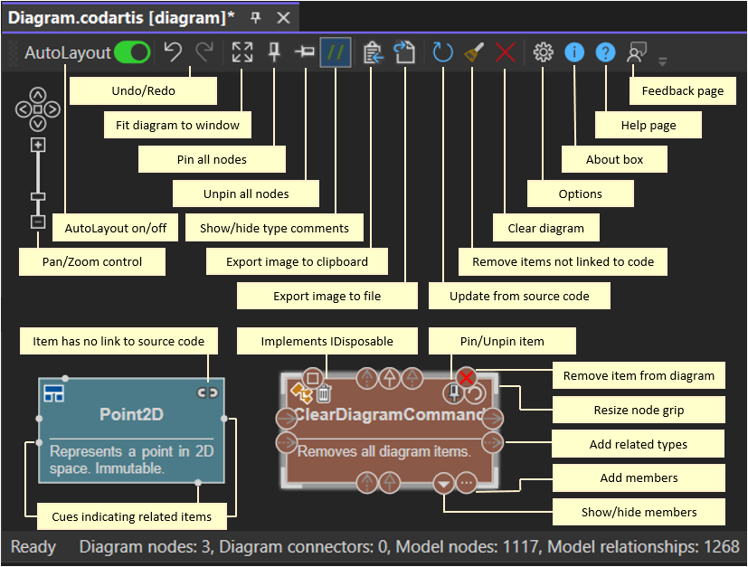
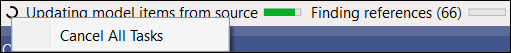

# Codartis Diagram Tool - Using the Diagram Tool

Learn how to use the features of the Codartis Diagram Tool to visualize and explore your code.

---

**Help Topics**
* [Getting Started](getting-started.md)
* Using the Diagram Tool
* [Diagram Elements and Notation](diagram-notation.md)
* [Troubleshooting](troubleshooting.md)

---

**Page Overview**
- [Controls at a glance](#controls-at-a-glance)
- [Saving and loading diagrams](#saving-and-loading-diagrams)
- [Pan](#pan)
- [Zoom](#zoom)
- [Selecting nodes](#selecting-nodes)
- [Resizing nodes](#resizing-nodes)
- [Pinning nodes](#pinning-nodes)
- [Removing nodes from the diagram](#removing-nodes-from-the-diagram)
- [Automatic layout and manual adjustments](#automatic-layout-and-manual-adjustments)
- [Jumping from diagram to source code](#jumping-from-diagram-to-source-code)
- [Updating the diagram from source code](#updating-the-diagram-from-source-code)
- [Monitoring and canceling background tasks](#monitoring-and-canceling-background-tasks)

---

## Controls at a glance

You can access diagram features from the toolbar, context menu, or from buttons that appear on diagram items when you hover over them.

## Saving and loading diagrams

Diagram saving and loading are fully integrated with Visual Studio. Diagram files (*.codartis) behave like regular project files.
* Open them from Solution Explorer or via File → Open → File...
* Save them using Visual Studio toolbar buttons, File → Save / Save As / Save All, or Ctrl+S
* Create a new diagram via Solution Explorer → Right-click project → Add → New Item → Codartis Diagram

Note that the **Codartis Diagram** file type appears in the **Add New Item** dialog only when adding items to a C# project (not, for example, to Solution Folders). Use these workarounds:
* Add the new diagram to a C# project, then move it to the desired location in Solution Explorer.
* Create an empty text file and rename its extension to `.codartis`. It will be recognized as a Codartis Diagram file.

Diagrams are saved into text files, in JSON format, to make it easy to store them in source control systems.

When a diagram is loaded, the tool automatically tries to reconnect each item to its corresponding symbol in the current solution.
* Items that no longer exist (e.g. deleted or renamed) appear with a **broken link** icon.
* Use the **broom** toolbar button to remove all unlinked items.

## Pan
* With the mouse: 
  * Hold the **left** mouse button on the background and drag
* With the keyboard: 
  * Use the **arrow keys** (when the diagram window has focus)
* Or: Use the **pan and zoom control** on the diagram.

## Zoom
* With the mouse: 
  * Scroll the **mouse wheel**
* With the keyboard: 
  * Use the **+/-** keys (when the diagram window has focus)
* Or: Use the **pan and zoom** control on the diagram.

## Selecting nodes
* Click a node to select or unselect it.
  * Ctrl+Click or Shift+Click to add/remove nodes from selection.
* Drag to select multiple nodes:
  * Ctrl+Drag – select multiple
  * Shift+Drag – add nodes to selection
* Context menu:
  * Select All Nodes (shortcut: Ctrl+A)

## Resizing nodes
* Drag any of the resize handles at the corners of a node to adjust its size.
* Double-click a resize handle to restore the node to its default size.
* Or use the Context Menu → Reset Size option.

## Pinning nodes
Pin nodes to fix their position so the automatic layout engine doesn’t rearrange them.
* Use the Pin button on a node to toggle its state.
* Or use the toolbar buttons:
  * Pin All Nodes
  * Unpin All Nodes

## Removing nodes from the diagram
* Click the Close button on a node to remove it from the diagram.
* Click the Clear button on the toolbar to remove all items.
* Use the Context Menu → Remove Item option to remove the selected nodes.
* Or press the Delete or Backspace keys to remove the selected nodes.

## Automatic layout and manual adjustments
Codartis Diagram Tool automatically arranges diagram elements to create a clear and meaningful layout. As the diagram changes, the layout is continuously updated. While you interact with the diagram, automatic layout is temporarily suspended.

You can enable or disable automatic layout at any time using the Auto-Layout toggle on the toolbar.

You can also manually refine the layout by moving or pinning nodes. By default, nodes that are moved or resized are automatically pinned, but this behavior can be changed via the Options toolbar button.

The automatic layout engine follows these rules:
* Nodes never overlap.
* Inheritance and implementation hierarchies are arranged top-down — more abstract types appear above more concrete ones.
* Sibling nodes within hierarchies are ordered alphabetically from left to right.
* Assembly references are arranged top-down.
* Pinned nodes are only repositioned if needed to prevent overlaps.

> If you’d like to see improvements to the automatic layout feature, please vote or comment on this discussion: [Enhance automatic diagram layout](https://github.com/Codartis/DiagramTool/discussions/4)

## Jumping from diagram to source code
* Double-click a diagram node to open its source definition.
* Works only for items found in source code (not metadata).

## Updating the diagram from source code
Keep your diagram in sync with the latest source code:
* Update a **single item** (and its relationships) using its Update button.
* Update the **entire diagram** using the **Update** toolbar button.

> For large solutions, updating the whole diagram can be slow — prefer updating individual items.

Update rules:
* Matching items (by fully qualified name) are refreshed with current relationships and members.
* Missing items are marked with a **broken link** icon.
* Remove all broken items using the **Broom** toolbar button.

> Renamed items are treated as new symbols — the tool cannot track renames automatically.

## Monitoring and canceling background tasks
The Codartis Diagram Tool builds its code model by querying Visual Studio’s C# parser.
These queries may take time — especially right after opening a large solution while Visual Studio is still parsing it.

To keep the tool responsive, all queries run as background tasks.
* The **status bar** shows the progress of active background tasks.

You can cancel background tasks anytime:
* Right-click the **spinning circle icon** on the left side of the status bar → select Cancel All Tasks.

