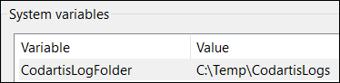
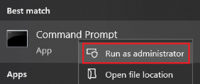
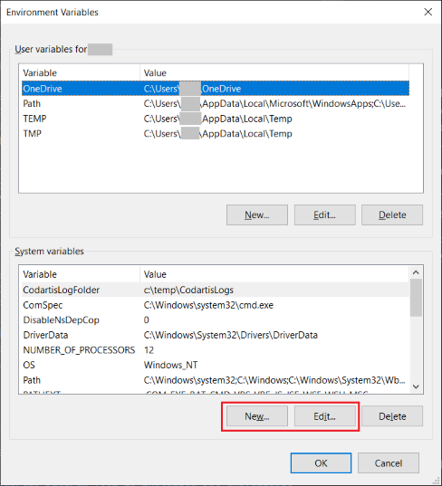
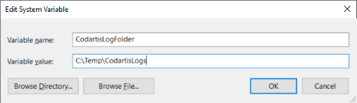
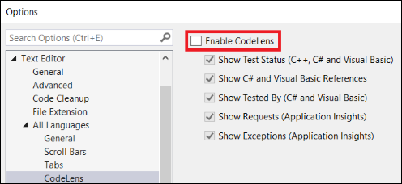

# Codartis Diagram Tool - Troubleshooting

Learn how to enable logging and resolve common issues.

---

**Help Topics**
* [Getting Started](getting-started.md)
* [Using the Diagram Tool](how-to-use.md)
* [Diagram Elements and Notation](diagram-notation.md)
* Troubleshooting

---

**Page Overview**
- [Logging](#logging)
- [How to Set a System Environment Variable](#how-to-set-a-system-environment-variable)
- [Codartis Diagram Tool Is Installed but Unavailable](#codartis-diagram-tool-is-installed-but-unavailable)
- [Error: “The requested operation requires elevation” When Installing from VSIX](#error-the-requested-operation-requires-elevation-when-installing-from-vsix)
- [Diagram Update Progress Appears Stuck](#diagram-update-progress-appears-stuck)

---

## Logging
You can enable logging to collect diagnostic information.

> Administrator rights are required to complete these steps.

1. Create a folder for the log files, e.g., `C:\Temp\CodartisLogs`
2. Define a **system environment variable** named **CodartisLogFolder** and set its value to the full path of the log folder you created.
  

> For detailed instructions, see [How to set a system environment variable](#how-to-set-a-system-environment-variable)

3. Restart Visual Studio so it can detect the new environment variable.
4. The log files will appear in the specified folder, named in the format `qd-<processid>.log`.

To turn off logging, delete the **CodartisLogFolder** environment variable.

> Remember to disable logging when it’s no longer needed to conserve disk space. 

## How to Set a System Environment Variable

1. Open a Command Prompt **as Administrator**:
   * Click the Windows Start Menu and type: `cmd`
   * Right-click **Command Prompt** and choose **Run as administrator**.
   

2. In the Command Prompt window, run this command:
  
   `rundll32.exe sysdm.cpl,EditEnvironmentVariables`

3. The **Environment Variables** window opens.
   * System variables are listed in the bottom half of the window.
   * Click **New** to create a variable or **Edit** to modify an existing one.
   

4. In either case, fill in both the **Variable name** and **Variable value** fields.
   

5. Click **OK** to close the dialog, and again to close the Environment Variables window.
6. Restart Visual Studio to apply the changes.

## Codartis Diagram Tool Is Installed but Unavailable
Symptoms
* Codartis Diagram Tool’s menu items do not appear under **View** | **Other Windows** or in context menus.
* When trying to activate it using the keyboard shortcut, Visual Studio shows:
  
  `The key combination (Ctrl+Shift+D, Ctrl+Shift+D) is bound to command (Codartis Diagram Tool) which is not currently available.`

Cause
* Codartis Diagram Tool uses the C# parser model generated by Visual Studio for the currently open solution.
If no solution is open, the tool is not loaded.

Solution
1. Open a solution in Visual Studio.
2. If the tool remains unavailable, wait a few moments for Visual Studio to finish loading it.

## Error: “The requested operation requires elevation” When Installing from VSIX
Details
* When installing the tool by double-clicking the downloaded `.vsix` file, Windows may display this error message.

Solution
1. Right-click the VSIX file → **Open with…**
2. Choose **Microsoft Visual Studio Version Selector** (you may need to click *More apps* to find it).
3. When prompted with `Do you want to allow this app to make changes to your device?` click **Yes**.

## Diagram Update Progress Appears Stuck
Symptoms
* In **Task Manager** → **Details**, the process `ServiceHub.RoslynCodeAnalysisService.exe` shows low CPU usage but a high and continuously increasing thread count.

Cause
* This may indicate that Codartis Diagram Tool and Visual Studio’s **CodeLens** feature are interfering with each other.

Solution
1. Turn off CodeLens:
   * Go to **Tools | Options | Text Editor | All Languages | CodeLens**.
   * Clear the **Enable CodeLens** checkbox.
    

2. Restart Visual Studio.

